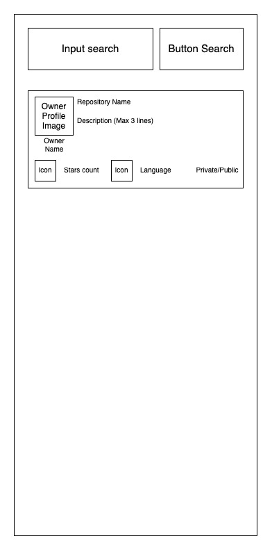
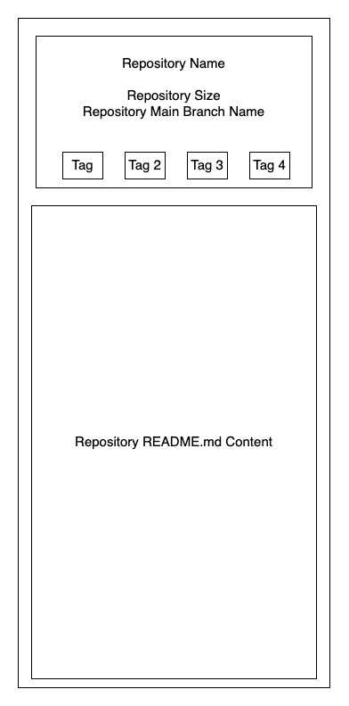

# Prueba técnica para postulantes (Android/iOS)

La siguiente es una prueba para evaluar a los postulantes enfocada en desarrollo Android/iOS.

# Introducción.

Este repositorio contiene una serie de requerimientos, que busca evaluar las capacidades técnicas del candidato con respecto a las principales funciones y responsabilidades que se requieren dentro del área de Desarrollo de Coppel.

## ¿Qué se busca evaluar?

Principalmente los siguientes aspectos:

- Estructuración de una aplicación: Conocimiento e implementación de patrones de arquitectura y de diseño para el desarrollo móvil.
- Calidad del código entregado: Conocimiento y uso de buenas prácticas de codificación.
- Familiaridad con los entornos de desarrollo: Conocimiento y uso de las últimas herramientas que proporciona cada plataforma (Android/iOS).
  - Ej: Android Jetpack, iOS SwiftUI

# Instrucciones previas al desarrollo.

1. Se requiere de una cuenta de GitHub para realizar esta prueba.
2. Antes de comenzar a programar:
   1. Realice un Fork de este repositorio.
   2. Clone el fork a su máquina local.
   3. Cree una rama con su nombre completo en su repositorio local.
      - ej: git checkout -b ERNESTO_HERNANDEZ_CHAVEZ
3. Al finalizar, existen 2 (dos) opciones para entregar su proyecto:
   1. [Pull Pequest](https://docs.github.com/en/pull-requests/collaborating-with-pull-requests/proposing-changes-to-your-work-with-pull-requests/creating-a-pull-request-from-a-fork):
      1. Hacer un push de su rama local a github.
      2. Crear un Pull Request de la rama con su NOMBRE al repositorio de origen.
      3. Notificar de la creación del pull request al correo de contacto que se le haya proporcionado.
   2. Entrega por correo:
      1. Crear un archivo comprimido (.zip o .rar) de su proyecto.
      2. Enviar el zip como archivo adjunto al correo de contacto que se le haya proporcionado.
4. En caso de ser necesario se debe incluir instrucciones, llaves de apis de terceros o cualquier otro dato necesario para correr la aplicación en un archivo README.md.

# Aplicación de exploración y búsqueda de repositorios en github.

Se requiere crear una aplicación móvil que proporcione las siguientes funciones principales:

- Inicio de sesión.
- Listado de repositorios.
- Búsqueda de repositorios.
- Visualización de detalles de un repositorio.

## Pantallas

A continuación se presenta el listado de las pantallas y los elementos mínimos que deben contener.

### Pantalla de inicio de sesión.

- Botón de inicio de sesión.

### Pantalla principal:

- Input de búsqueda.
- Botón de búsqueda.
- Listado con scroll infinito en donde cada ítem debe tener:
  - Imagen de perfil del dueño
  - Nombre del dueño
  - Nombre del repositorio
  - Descripción del repositorio
  - Número de estrellas
  - Lenguaje principal del repositorio
  - Privacidad del repositorio

### Pantalla de detalle de repositorio.

- Nombre del repositorio
- Tamaño en MB
- Nombre de la rama principal
- Tags asociadas (máximo 4 tags)
- Contenido del archivo README.md

## Casos de Uso

### Login

1. El usuario accede a la pantalla de login y da click al botón de inicio de sesión.
2. La aplicación inicia la autenticación mediante github (Firebase).
3. La aplicación muestra la pantalla principal (Home).

### Visualizar listado de repositorios

1. El usuario accede a la página principal.
2. La aplicación muestra el listado de los repositorios en tendencia en los últimos 7 días.

### Visualizar más elementos del listado

1. El usuario en la página principal hace scroll hacia abajo hasta llegar al último elemento del scroll.
2. La aplicación obtendrá la lista de los siguientes elementos a mostrar y con estos actualiza la lista.

### Búsqueda por nombre

1. El usuario en la pantalla principal introduce parámetros en el input de búsqueda.
2. El usuario da click al botón de búsqueda.
3. La aplicación obtiene los elementos con base en el input del usuario.
4. La aplicación actualiza el listado con los elementos obtenidos.

### Visualizar detalles de un elemento

1. El usuario en la pantalla principal da click a un elemento del listado.
2. La aplicación obtendrá los datos del elemento y mostrará estos datos en la pantalla de detalles.

## Reglas de negocio

- Cualquier operación que bloquee el hilo principal debe ejecutarse asíncronamente mientras que en la pantalla de la aplicación se muestra un loader.
- En caso de cualquier error de la API o de procesos internos de la aplicación se le debe informar al usuario.

## Documentación de API y enlaces relevantes

- Gihub API: https://docs.github.com/en/rest/repos/repos
- Firebase Auth: https://firebase.google.com/docs/auth
